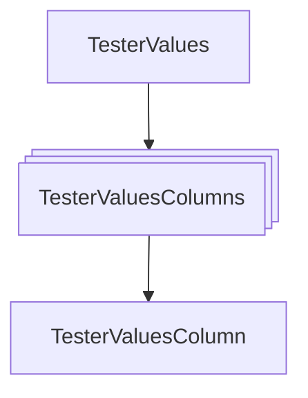
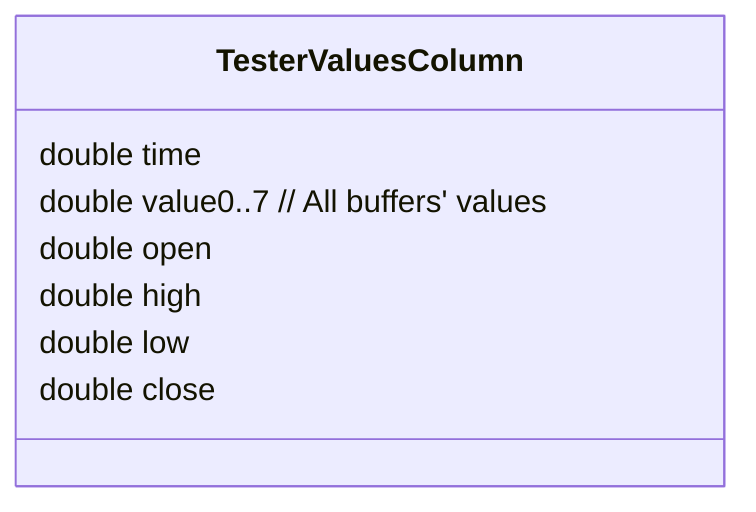
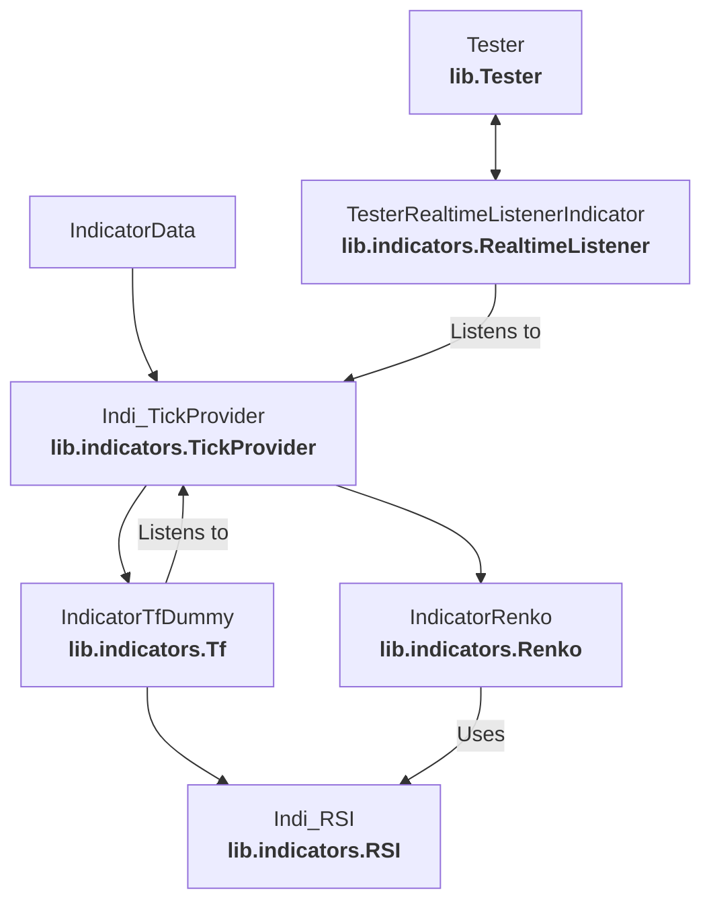

# Running Indicators

## Indi_TickProvider

In the C++/Emscripten version we need to use `Indi_TickProvider`-derived class as a top indicator for all indicators added to the **Tester** or **Platform** classes.

`Indi_TickProvider` allows us to feed it with historic ticks and simulate incoming ticks (we can just call `Tick()` on it until it returns false which indicates end of the history).

`Indi_TickProvider`, as being a listener for **Candle** indicators and **Candle** indicators being listeners for tested indicators will effectively send bars for tested indicators for each tick.

## Tester

**Tester** is a testing/live platform for indicators. Main purpose of it is to run specialized backtests for indicators and to display results in a user-friendly manner.

**Tester** class take care of executing `Tick()` on all indicators added for testing (except added **Candle** and **Tick** indicators). Those indicators then calls `Tick()` for indicators up the hierarchy which effectively calls `Tick()` on **Candle** indicator which then calls `Tick()` on the parent **Tick** indicator which signals new tick or not. If yes, `Platform::global_tick_index` is incremented.

## Platform's Global Tick Index

`Platform::global_tick_index` is incremented if any of the `Tick` indicators had new tick, so tested indicators could update it's value. E.g., **Candle** indicator could send new bar to all listeners (our tested indicators). Note that **MT** platform's **Tick** indicators (e.g., `Indi_TickMt`) are not supposed to be ran via **Tester** class as they are always signaling a new tick (their `Tick()` method is called in the `OnTick()` event and `Tick()` just does `MqlTick _tick_data; SymbolInfoTick(GetSymbol(), _tick_data);` to retrieve tick data).

## When to call Tester::RunTick/Tester::RunAllTicks()

In the backtest scenario we just run `Tester::RunAllTicks()` to perform whole test in a single run or `Tester::RunTick()` to simulate real-time testing (or just not to hang testing environment).

In the realtime scenario, where there are live **Tick** indicators, we wouldn't like to call `Tester::RunTick()` at the fixed interval just to ensure that ticks from all **Tick** indicators are processed. Thus way we need to:

### Feature requirement

`IndicatorData` must be able to signal new tick in asynchronic manner. Thus way we will use existing `IndicatorData::EmitEntry()` method which emits data to listeners. We will extend the `ENUM_INDI_EMITTED_ENTRY_TYPE` enumeration with `INDI_EMITTED_ENTRY_TYPE_LIVE_TICK` item, which will indicate that there is a new tick that happened during live run. We can't just emit `INDI_EMITTED_ENTRY_TYPE_TICK` as a normal tick, because tested indicators are not listeners for parent indicators (**Candle** indicators). We will create a special `Indi_TesterListener` indicator for **Tester** purposes which will register itself as a listener for all **Tick** indicators. `Indi_TesterListener` will override `IndicatorData::OnDataSourceEntry()` method which will call `Platform::RunTick()`.

# Indicator Buffer

## Feature requirement

In order to support Renko indicators and have ability to retrieve bars/collect ticks to form bars, we need to introduce 

...

# IndicatorTest (Tester)

Main class used for testing in C++/Emscripten environment.

## Chart Functionality Requirements

Note that `Tester` class is an Emscripten synonym to `IndicatorTest` class.

We need two ways of displaying data on the chart:
- As bars for time-frame-based indicators (standard ones) where each bar indicates e.g., 5min time-frame
- As markers/bricks for indicators that doesn't use time, but just the marker/brick size and color/other details. An example of such indicator is Renko.

### Chart Data

Firstly we need to determine the time distance we want to see on the chart and time of a single step - essentialy the time on the left boundary and right boundary of the bars/dots in the window and distance between bars/dots on the chart. The boundary is not the rectangle of the window, but a little thinner rectangle, so left and right borders are position in center of the bars. We can use `IndicatorTest::GetTimeByScrollAndZoom()` to determine mentioned values. The input is:
- Scroll value in seconds, where 0 is the oldest time in history, not the most recent time
- Zoom level, where increasing zoom means zooming in
Result of the call to `IndicatorTest::GetTimeByScrollAndZoom()` could be directly passed to `IndicatorTest::GetValues()` method in order to retrieve `TesterValues` object containing columns:
- Those containing time of origin (from TF-based indicators)
- Those without time like Renko indicator which we still need to display
`TesterValues` containes bar/marker information like: type of value, OHLC, time open, time close, volume, optional name of the bar/marker.

#### Required modification

`TesterValues` currently holds array of `TesterValuesColumn` structures for TF and non-TF indicators' values (each column holds an array of `TesterValuesColumnValue`). The problem is that values are not grouped by indicator then column, but by column and then indicator (each value has name of the indicator), which is not optimal.

The idea is for `TesterValues` to hold array of `TesterValuesColumn` per indicator, so `TesterValues` will hold an array of `TesterValuesColumns` which each holds ID/name of the indicator and array of `TesterValuesColumn` which will finally store the value for the column (time, OHLC and so on), so we don't need additional `TesterValuesColumnValues` structure.

## Fetching Data From History

### Chart Display

We're able to display data in two ways:
- As columns, when time-step/time-frame of the indicator is fixed so we can easily show values or grouped values (when zoomed out) as columns of a fixed size and distance between them.
- As markers/bricks/any other form if indicator is not using time-frame (TF). An example of non-TF indicator is Renko.

As displaying columns is an easy task, non-TF indicators requires more attention. Values for non-TF indicators may be distributed across the timeline or even have no associated time.

Happily, we can relate Renko indicator's bricks with a time when they happened, so that's a good starting point to the process of displaying them on the chart.

#### Considerations

The question is: When do we want to start displaying Renko bricks on the chart and in which direction? Maybe both directions? From the position (in time) of mouse pointer?

### Indicator On Indicator Testing For Non-TF Base

#### Considerations

Scenario: We want to use Moving Average on the Renko indicator. RSI is TF-based, Renko not.

When calculating value for the MA, it just uses the last values of the Renko, however, after the value of MA is estabilished, Renko indicator may create new entry. The problem is that MA indicator will become desynchronized and it's last value no longer correspond to the average of Renko values.

We need a way to force indicator on the lower level in hierarchy to update its last value.

#### Zooming

Preferred way of zooming is to zoom in exactly into position of the cursor and zoom out the same way.

# IndiBufferCache

Purpose of the class is to cache calculated values of i*INDICATOR*OnArray() methods when they are consecutively called for the same indicator and parameters. Using such buffer we could just previously calculated value (`prev_calculated`) in the buffer with a value from `OnCalculate()` method. Such buffer holds a single or OHLC prices as *ValueStorage* buffers which `OnCalculate()` could work on as it was just a price buffer. An example of such buffering is `Indi_MA::iMAOnArray()` method which reuses price buffer and calls `Indi_MA::Calculate` to work on that buffer and update its last calculated value. Without such a buffer, each call to i*INDICATOR*OnArray() method would involve recalculation of the whole price history for some indicators, where e.g., only last 30 bars are needed.

`OnCalculate()` methods requires that buffer has set input prices, either single or OHLC, we can set it via `_cache PTR_DEREF SetPriceBuffer(...);`. It is required before we can call `OnCalculate()`. There are macros that prepares prices for `OnCalculate()` from the cache.

When `OnCalculate()` method requires output buffers then we add them via `_cache PTR_DEREF AddBuffer<NativeValueStorage<double>>();`. We can check if buffers weren't already added via `_cache PTR_DEREF HasBuffers()`.

In order to update index of the `prev_calculated` value for the buffer, we use `_cache PTR_DEREF SetPrevCalculated(shift)`, which is the result of the call to `OnCalculate()` method.

To retrieve last/prev calculated value we can use `_cache PTR_DEREF GetTailValue<double>(0, rel_shift);` where `rel_shift = 0` indicates last/prev calculated value which is the result of calculation of `OnCalculate()` method.

# Real-life usage

## Test scenario

